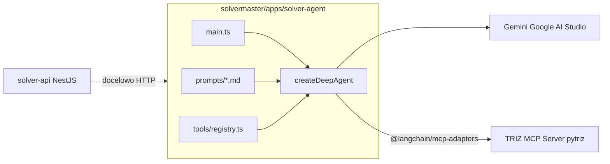

# Plan: Agent LangChain/Deep Agents (TypeScript) + TRIZ MCP (pytriz)

> Zatwierdzony plan implementacji. Agent w TypeScript w monorepo `solvermaster/`.
> LLM: Gemini (Google AI Studio, `GOOGLE_GENERATIVE_AI_API_KEY`).

## Cel

Miejsce uruchomienia agenta LangChain/Deep Agents, który przez zdefiniowane narzędzia (MCP → pytriz) rozwiązuje problemy inżynierskie. Na start: fake prompt + integracja z TRIZ MCP Server.

## Stack docelowy (TypeScript only)

| Warstwa | Technologia |
|---------|-------------|
| Agent harness | `deepagents` (`createDeepAgent`) |
| LLM | `@langchain/google-genai` + `GOOGLE_GENERATIVE_AI_API_KEY` |
| Narzędzia MCP | `@langchain/mcp-adapters` (`MultiServerMCPClient`) |
| Monorepo | Nx — `solvermaster/apps/solver-agent` |
| MCP backend | Zewnętrzny [gdg-mcp-workshop](https://github.com/mmysior/gdg-mcp-workshop) (pytriz, `:8123/mcp`) |

## Python w repo — poza scope tego zadania

W katalogu `ai/` jest istniejący kod Python (18 plików `.py`):

| Katalog | Rola | Dotyczy agenta? |
|---------|------|-----------------|
| `ai/solver/` | Wczesny MVP pipeline (TRIZ + SCAMPER), deploy `solver-be` | **Nie** — legacy, nie rozwijamy |
| `ai/solver/service/` | Prosty HTTP serwis Python na Cloud Run | **Nie** — zastąpiony przez `solver-api` (NestJS) |
| `ai/evals/` | Scoreboard hackathonowy, `mcp_eval.py` | **Opcjonalnie** — dev smoke test MCP |
| `ai/integrations/discord/` | Scraper Discord | **Nie** |

**Ten plan nie dodaje ani nie modyfikuje Pythona.** Agent TS łączy się z pytriz wyłącznie przez MCP (HTTP). Biblioteka pytriz nie jest importowana do `solvermaster/`.

Produkt aplikacyjny: **`solvermaster/`** (Angular + NestJS + nowy `solver-agent`).



## Lokalizacja: `solvermaster/apps/solver-agent`

Nowa aplikacja Nx obok `solver-api`. MVP: CLI / Node runner (`nx serve solver-agent`).

### Struktura plików

```
solvermaster/apps/solver-agent/
  project.json
  tsconfig.json
  tsconfig.app.json
  webpack.config.js
  README.md
  .env.example
  src/
    main.ts
    config.ts
    agent.ts
    prompts/
      loader.ts
      system.md
      user_fake.md
    tools/
      mcp-triz.ts
      registry.ts
```

### Separacja odpowiedzialności

| Warstwa | Plik | Rola |
|---------|------|------|
| Prompt | `src/prompts/system.md`, `user_fake.md` | Tekst edytowalny bez zmiany logiki |
| Narzędzia | `src/tools/mcp-triz.ts` | Połączenie z TRIZ MCP (6 tooli pytriz) |
| Agent | `src/agent.ts` | `createDeepAgent({ model, tools, systemPrompt })` |
| Uruchomienie | `src/main.ts` | Entry point agenta |

## Zależności npm

Dodać do `solvermaster/package.json`:

```json
{
  "dependencies": {
    "deepagents": "^0.x",
    "langchain": "^1.x",
    "@langchain/core": "^1.x",
    "@langchain/langgraph": "^1.x",
    "@langchain/mcp-adapters": "^0.x",
    "@langchain/google-genai": "^2.x",
    "dotenv": "^16.x",
    "zod": "^3.x"
  }
}
```

**Gemini + MCP — ryzyko 400:** jeśli `@langchain/google-genai` zwraca 400 na schematy tooli, użyć `@h1deya/langchain-google-genai-ex` (`ChatGoogleGenerativeAIEx`).

## Konfiguracja (`src/config.ts`)

| Zmienna | Domyślnie | Opis |
|---------|-----------|------|
| `GOOGLE_GENERATIVE_AI_API_KEY` | — (wymagane) | Klucz Google AI Studio |
| `MCP_SERVER_URL` | `http://localhost:8123/mcp` | TRIZ MCP (pytriz) |
| `AGENT_MODEL` | `gemini-2.5-flash` | Model Gemini |

```typescript
import { ChatGoogleGenerativeAI } from "@langchain/google-genai";

const model = new ChatGoogleGenerativeAI({
  model: process.env.AGENT_MODEL ?? "gemini-2.5-flash",
  apiKey: process.env.GOOGLE_GENERATIVE_AI_API_KEY,
});
```

## Narzędzia MCP (`src/tools/mcp-triz.ts`)

```typescript
import { MultiServerMCPClient } from "@langchain/mcp-adapters";

export async function loadTrizMcpTools(url: string) {
  const client = new MultiServerMCPClient({
    triz: { transport: "http", url },
  });
  return { client, tools: await client.getTools() };
}
```

Tooli pytriz: `browse_contradiction_matrix`, `get_principle_by_id`, `get_parameter_by_id`, `get_random_principles`, `search_parameter`, `search_principle`.

MVP bez embeddings/Ollama — fake prompt używa matrix + lookup po ID.

## Fake prompt na start

**`system.md`:** Agent TRIZ, narzędzia MCP, odpowiedź po polsku.

**`user_fake.md`:** Problem e-waste / SDG 12 — bezpieczny odzysk materiałów przy rocznych upgrade'ach telefonów.

## Uruchomienie

```bash
# 1. MCP server (zewnętrzny workshop repo)
cd ~/gdg-mcp-workshop/mcp-server && uv sync && uv run python app/main.py

# 2. (Opcjonalnie) smoke test MCP
cd ai/evals && python mcp_eval.py --url http://localhost:8123/mcp

# 3. Agent TS
cd solvermaster
npm install
export GOOGLE_GENERATIVE_AI_API_KEY=...
npx nx serve solver-agent
```

## Zadania implementacyjne

1. Wygenerować `solvermaster/apps/solver-agent` (Nx) + zależności LangChain
2. Dodać `prompts/system.md` i `prompts/user_fake.md`
3. Zaimplementować `tools/mcp-triz.ts` + `tools/registry.ts`
4. Zaimplementować `agent.ts` (`createDeepAgent` + Gemini)
5. Dodać `main.ts` / `nx serve`
6. README z instrukcją uruchomienia

## Poza zakresem MVP

- Deploy Cloud Run + CI/CD
- Vendoring MCP server do repo
- Integracja HTTP `solver-api` ↔ `solver-agent`
- Pełny hackathon prompt (5 kroków, SCAMPER, ewaluacja)
- Modyfikacja / usuwanie `ai/solver/` (Python legacy)
- Testy jednostkowe (mock MCP)

## Ryzyka

| Ryzyko | Mitigacja |
|--------|-----------|
| Gemini 400 na MCP schemas | `@h1deya/langchain-google-genai-ex` |
| MCP server nie działa | Preflight w `main.ts` |
| Brak klucza API | Walidacja w `config.ts` |
| Semantic search wymaga Ollama | MVP: tylko matrix/lookup |
| Peer deps deepagents | Jawne pakiety `@langchain/*` w package.json |
